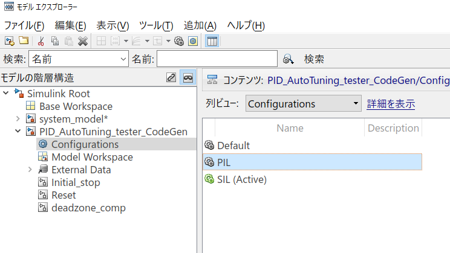
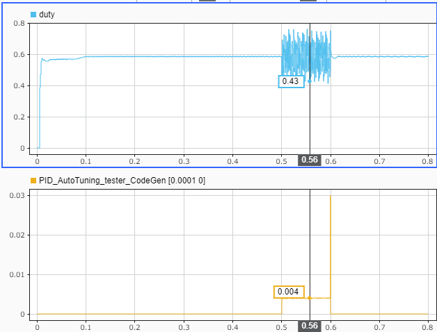
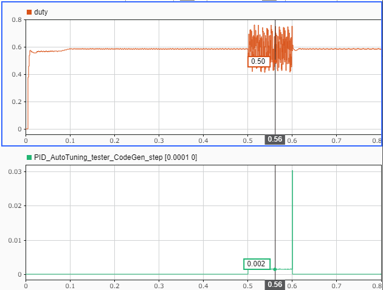

# PID AutotunerのPIL検証
# 初期化

```matlab:Code
open_system(system_model_name);
controller_name = 'PID_AutoTuning_tester_CodeGen';
load_system(controller_name);
set_param([system_model_name, '/Controller'], 'ModelName', controller_name);
```


調整の実行中、プラントモデルのEDLCの電圧が変化しないようにしたい。そのために、EDLCの容量を十分大きな値に設定する。


```matlab:Code
set_slddVal('system_data.sldd', 'EDLC_Capacitance', 100);
```


モデルをゲイン調整用に設定する。


```matlab:Code
Iout_ref = 20;
open_system([system_model_name, '/Reference/dist_cur_swith']);
```

  
# モデルを実行して動作確認

```matlab:Code
sim(system_model_name);
plot_results_in_SDI;
```

  
# Embedded Coder®コード生成


'PID_AutoTuning_tester_CodeGen.slx'を組み込みマイコン用にCコード生成する。'Ctrl + B'のショートカットを入力すると、コード生成が行われる。静的コード指標を確認すると、グローバル変数のサイズと静的スタックサイズは以下のようになった。


  
# PIL検証


本節では、例としてSTM32 Nucleo F401REを用いたPIL検証を行う。STM32 Nucleo F401REの性能は以下の通りである。


   -  CPU: Coretex-M4F 
   -  Clock: 84MHz 
   -  Flash ROM: 512kB 
   -  SRAM: 96kB 


PIL検証の手順は使用する環境に依存している。以下の手順を参考に、各自の実装環境で行うこと。


'PID_AutoTuning_tester_CodeGen.slx'のコンフィギュレーションパラメータを修正し、ハードウェア実行、PILブロックを生成できるように設定する。参考までに、'PID_AutoTuning_tester_CodeGen.slx'のConfigurationsに「PIL」を用意している。





'system_model.slx'内の'Controller'ブロックのシミュレーションモードをPILに変更し、モデルを実行する。


実行時のduty値と各ステップでかかった計算時間は以下のようになった。





PIDゲインの推定時には約4msの計算時間が必要であることがわかる。また、推定計算の最後は約30msの計算が行われている。推定後も適切に制御を続行する必要がある場合は、この計算も制御のタイムステップ以内に終わらせる必要がある。


この時、'Closed-Loop PID Autotuner'ブロックのブロックパラメータで「異なるサンプル時間で調整」にチェックを入れ、「調整サンプル時間（秒）」をPID制御器と異なる時間に設定すれば、推定計算の最後の処理は別のタスクとして実行させることができるようになる。これにより、推定後も制御を安定させることができる。





実行結果は以下のようになる。紫色の波形が推定計算の最後の処理を実行する50msのタスクの実行時間である。


モデルの変更を戻す。


```matlab:Code
set_slddVal('system_data.sldd', 'EDLC_Capacitance', 0.1);
open_system([system_model_name, '/Reference/dist_cur_swith']);
```

  


 Copyright 2020 The MathWorks, Inc.


