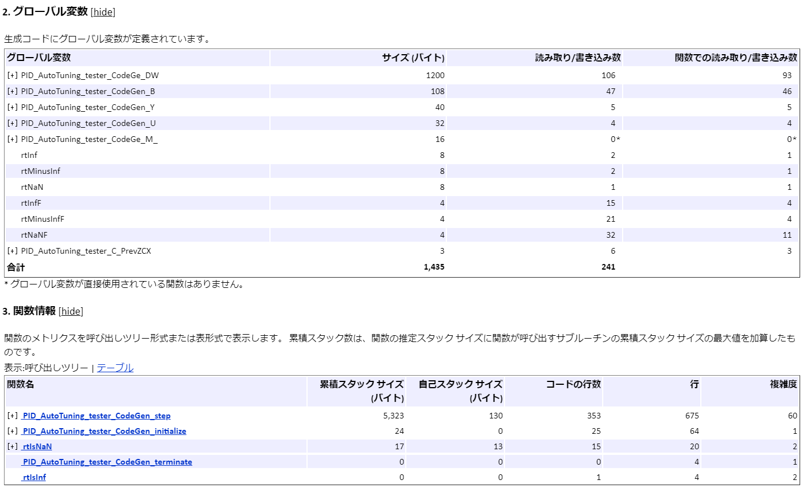
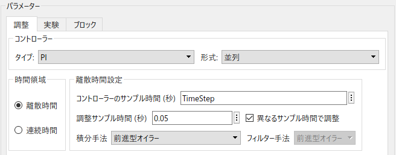
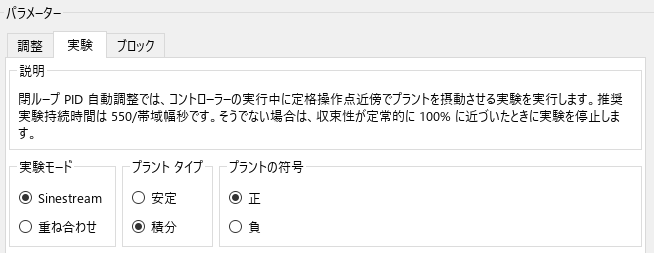
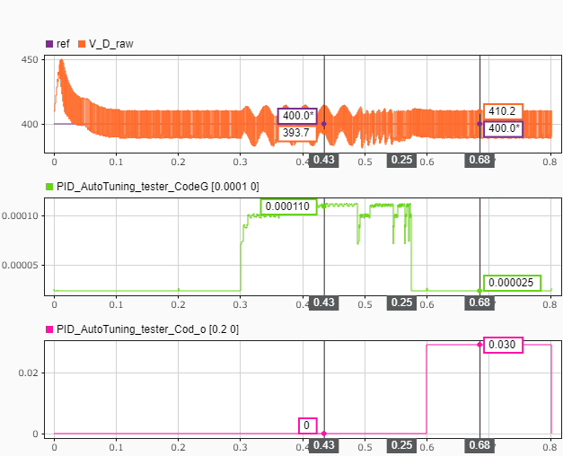

# PID AutotunerのPIL検証
# 初期化
```matlab
open_system(system_model_name);
controller_name = 'PID_AutoTuning_tester_CodeGen';
load_system(controller_name);
set_param([system_model_name, '/Controller'], 'ModelName', controller_name);
```

調整の実行中、プラントモデルのEDLCの電圧が変化しないようにしたい。そのために、EDLCの容量を十分大きな値に設定する。

```matlab
set_slddVal('system_data.sldd', 'EDLC_Capacitance', 100);
```

モデルをゲイン調整用に設定する。

```matlab
Iout_ref = 20;
open_system([system_model_name, '/Reference/dist_cur_swith']);
```

# モデルを実行して動作確認
```matlab
sim(system_model_name);
plot_results_in_SDI;
```

# Embedded Coder®コード生成

'PID\_AutoTuning\_tester\_CodeGen.slx'を組み込みマイコン用にCコード生成する。'Ctrl + B'のショートカットを入力すると、コード生成が行われる。静的コード指標を確認すると、グローバル変数のサイズと静的スタックサイズは以下のようになった。




# PIL検証

本節では、例としてSTM32 Nucleo F401REを用いたPIL検証を行う。STM32 Nucleo F401REの性能は以下の通りである。

-  CPU: Coretex\-M4F 
-  Clock: 84MHz 
-  Flash ROM: 512kB 
-  SRAM: 96kB 

PIL検証の手順は使用する環境に依存している。以下の手順を参考に、各自の実装環境で行うこと。


'PID\_AutoTuning\_tester\_CodeGen.slx'のコンフィギュレーションパラメータを修正し、ハードウェア実行、PILブロックを生成できるように設定する。参考までに、'PID\_AutoTuning\_tester\_CodeGen.slx'のConfigurationsに「PIL」を用意している。


'system\_model.slx'内の'Controller'ブロックのシミュレーションモードをPILに変更し、モデルを実行する。


この時、'Closed\-Loop PID Autotuner'ブロックのブロックパラメータで「異なるサンプル時間で調整」にチェックを入れ、「調整サンプル時間（秒）」をPID制御器と異なる時間に設定すれば、推定計算の最後の処理は別のタスクとして実行させることができるようになる。これにより、推定後も制御を安定させることができる。





また、実機をリアルタイム制御しながら'Closed\-Loop PID Autotuner'を実行する場合は、実験モードを"Sinstream"にすることを推奨する。"重ね合わせ"と比較すると、1ステップ当たりの推定計算時間を大きく削減することができる。


その代わりに、実験持続時間が"重ね合わせ"よりも多く必要である点に注意すること。





実行結果は以下のようになる。推定中は、制御のタスク（100μsのタスク）は、約100μsの計算時間を必要としていることがわかる。推定後は、0.2sのタスクが計算を行う。その計算には約30ms必要としている。その計算が終わった後に結果が出力される。





モデルの変更を戻す。

```matlab
set_slddVal('system_data.sldd', 'EDLC_Capacitance', 0.1);
open_system([system_model_name, '/Reference/dist_cur_swith']);
```


 Copyright 2020 The MathWorks, Inc.


