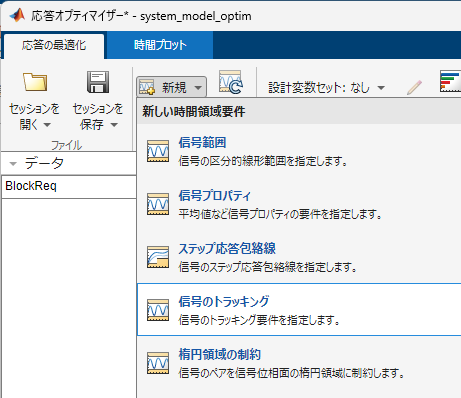
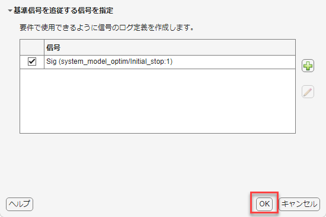
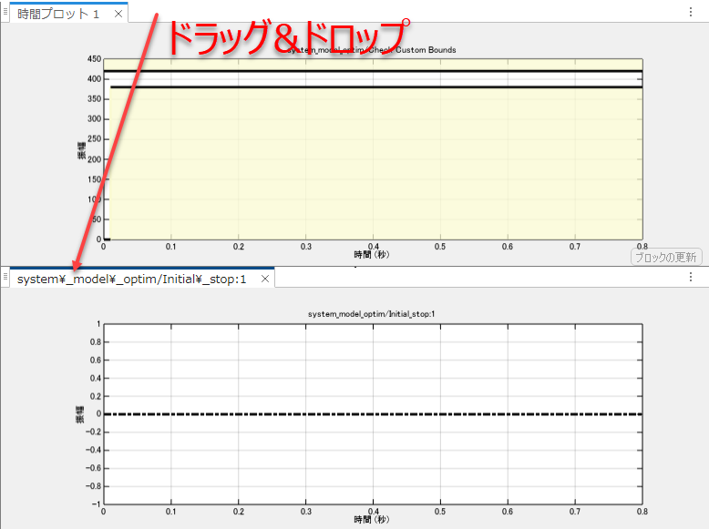
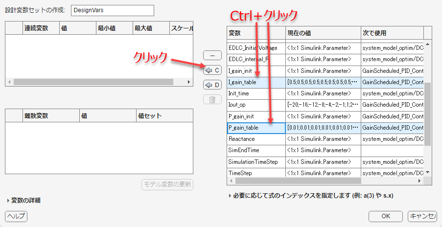
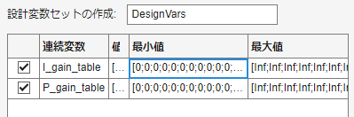
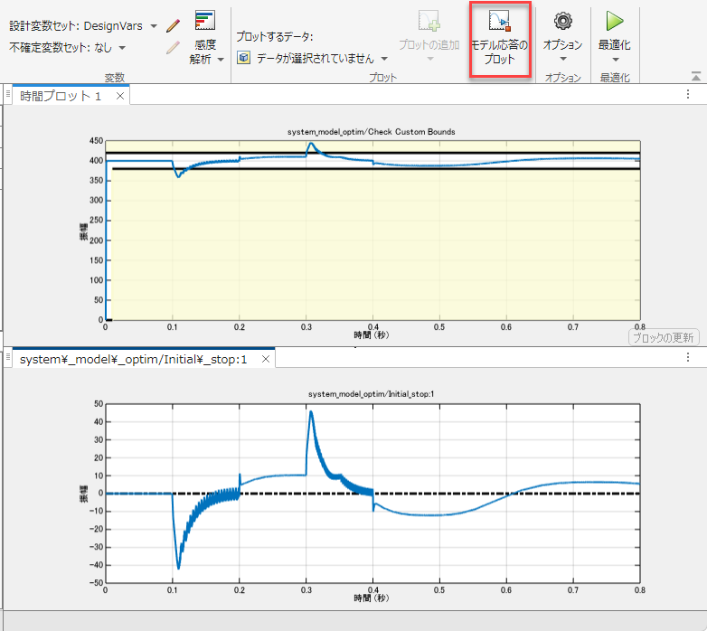
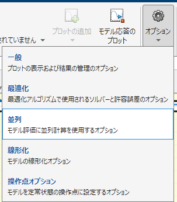

# PIDゲインスケジューリングを応答オプティマイザーを用いて設計する
# 初期化

```matlab:Code
system_model_name_2 = 'system_model_optim';
open_system(system_model_name_2);
controller_name = 'GainScheduled_PID_Controller';
load_system(controller_name);
set_param([system_model_name_2, '/Controller'], 'ModelName', controller_name);
```

  
# 設計課題の確認


設計課題については、「design_GainScheduling_with_Autotuner.mlx」を参照。


  
# ゲイン調整の準備


調整の実行中、プラントモデルのEDLCの電圧が変化しないようにしたい。そのために、EDLCの容量を十分大きな値に設定する。


```matlab:Code
set_slddVal('system_data.sldd', 'EDLC_Capacitance', 100);
```


必要に応じてアクセラレータ、ラピッドアクセラレータモードを使用する。


```matlab:Code
% set_param(system_model_name_2, 'SimulationMode', 'accelerator');
% set_param(system_model_name_2, 'SimulationMode', 'rapid-accelerator');
```

  
# 最適化アルゴリズム実行のための準備


ルックアップテーブルのテーブル値の初期値を設定する。


```matlab:Code
Iout_op = [
    -20; -16; -12; -8; -4; -2; -1;
    1; 2; 4; 8; 12; 16; 20];
P_gain_table = 0.01 * ones(size(Iout_op, 1), 1);
I_gain_table = 0.5 * ones(size(Iout_op, 1), 1);
```


モデルの動作を確認する。


```matlab:Code
sim(system_model_name_2);
```


```matlab:Code
Simulink.sdi.clearAllSubPlots;      % シミュレーションデータインスペクターのチェックを全て外す
plot_results_in_SDI;
```

# 応答オプティマイザーアプリを使って調整を行う


「アプリ」タブから「応答オプティマイザー」をクリックする。


開くと、自動的に「Check Custom Bounds」ブロックの設定が読み込まれる。


要件を新規に追加する。「新規」から「信号のトラッキング」をクリックする。





基準信号として、時間ベクトルに[0; 0.8]、振幅に[0; 0]を入れて「参照信号データの更新」をクリックする。


「基準信号を追従する信号を推定」の「＋」ボタンをクリックする。


「system_model_optim.slx」のdVout信号を選択状態にする。


信号セットの作成ウィンドウにて、選択した信号線が現れるので、この状態でOKボタンをクリックする。


トラッキングする信号が設定されたことを確認し、OKをクリックする。





見やすくなるように、グラフを上下に分割させる。


次に設計変数を設定する。「設計変数セット」から「新規...」をクリックする。


調整したい変数を複数選択し、左矢印Cをクリックする。Ctrl+クリックで複数選択することができる。





最小値を「zeros(1, 14)」とする。最小値の欄に入力してEnterとすると、自動的に値が評価され、以下のようになる。





※探索を効率よく行うために、最小値と最大値は可能な限り指定すること。今回の場合、制御ゲインはマイナスになることはないので、最小値を0とした。


OKをクリックして戻る。「モデル応答のプロット」をクリックし、応答を確認する。





最適化を始める前に、セッションを保存すること。


[最適化]ボタンをクリックし、最適化を開始する。


# Parallel Computing Toolboxを用いて並列実行させたい場合


並列オプションを開く。





「最適化中に並列プールを使用」にチェックを入れる。


「最適化オプション」タブに移動し、最適化手法を並列化に対応したものに変更する。


並列計算実行中、Windowsのタスクマネージャーなどを起動し、CPUやメモリの消費量を確認すること。


モデルの変更を戻す。


```matlab:Code
set_slddVal('system_data.sldd', 'EDLC_Capacitance', 0.1);
```

  


 Copyright 2020 The MathWorks, Inc.


